<!-- LTeX: language=es -->
# Descripción del proyecto

El presente proyecto consiste en realizar repositorios de GitHub de las tareas realizadas durante el semestre.
En total se tienen **7 tareas distintas** para subir.

En seguida se encuentran links a los distintos repositorios de GitHub
- [Resumen capítulo 1 de libro](https://github.com/notmar2/chapter1)
- [Documentación de código de IntCell](https://github.com/notmar2/intcell)
- [Proyecto 1](https://github.com/notmar2/DLList)
- [Documentación de código de lista ligada simple](https://github.com/notmar2/lists)
- [Creación de clase Stack con base a DLList.h](https://github.com/notmar2/Stack)
- [Documentación de Árbol](https://github.com/notmar2/tree)
- [Struct Wars: El Retorno del Árbol](https://github.com/notmar2/AVLTreeDocs)
- [Proyecto 2](#Proyecto-2)

## Explicación de desarrollo
En esta sección se tomará el proceso de un elemento. 
Se tomará en este caso el proceso de subida del código de SLList.
La razón para escoger este ejemplo en particular es la cantidad de código; 
puesto a que el repositorio contiene pruebas realizadas para reparar el código dentro de un subdirectorio,
la cantidad de código es mayor a otros repositorios creados este semestre.

El primer paso es crear el repositorio, veamos primero la estructura del directorio:
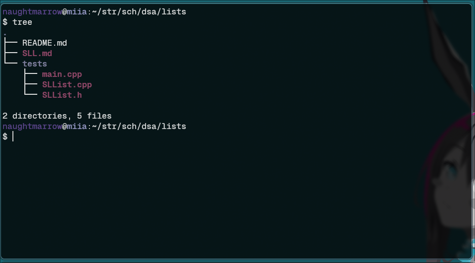 

Como podemos apreciar, tenemos un subdirectorio con 3 archivos, un archivo de markdown y el readme del repositorio.
Ahora procedamos a utilizar el comando `git init` para inicializar el repositorio en nuestro directorio.

El resultado es el siguiente:
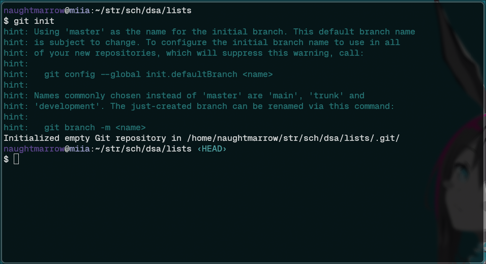

Ahora que tenemos un repositorio vacío podemos agregar todos los archivos en nuestro directorio.
Para esto podemos utilizar el comando `git add .`, el cual añade todo en `.` (el directorio actual) a nuestro repositorio de git.

Este comando por sí mismo no imprime nada a la consola. 
Sin embargo, podemos utilizar el comando `git status` para mostrar el estado del repositorio y comprobar que nuestros archivos se hayan añadido.
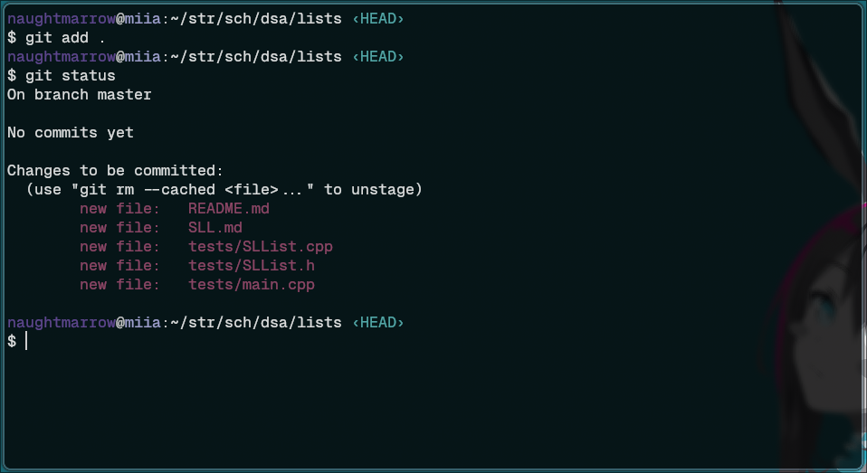

El siguiente paso es realizar nuestro commit. 
Sin embargo, antes de hacer un commit debemos añadir una identidad a nuestro commit.
Para esto debemos configurar las variables de `email` y `name`, ya sea global o localmente para solo este repositorio.
Debido a que tengo repositorios de varias cuentas distintas yo lo haré de manera local usando el comando `git config`.
`git config` toma el nombre de nuestra variable a configurar, en este caso `user.name` y `user.email`, además de un valor a ingresar.
Estos comandos no imprimen nada directamente a la consola, sin embargo, utilizando la bandera `--get` git imprimirá a la consola el valor de la variable de configuración que le pasemos.
De esta forma podemos apreciar los siguientes resultados:
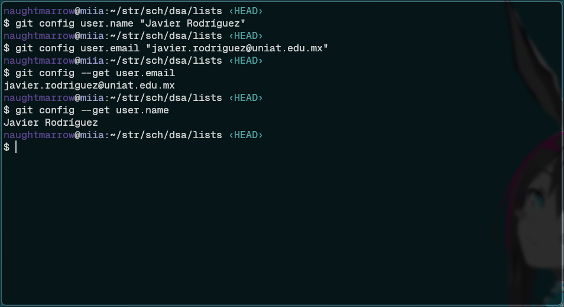

Ahora podemos por fin realizar nuestro commit.
Para este propósito podemos utilizar el comando `git commit`, en conjunto con la bandera `-m` y un string para añadir un mensaje a nuestro commit.
Es imperativo añadir un mensaje a nuestro commit, por lo que si no lo hacemos de esta forma el commando automáticamente tratará de abrir un editor de texto en el cual crear el mensaje.
De no encontrarlo simplemente nuestro commit fallará.
Veamos a continuación el resultado:
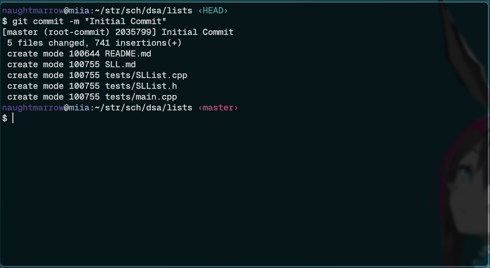

Una vez terminado nuestro commit local es hora de crear el repositorio en GitHub y subir nuestro repositorio.
Para esto simplemente debemos ir a la página de GitHub, ingresar a nuestra cuenta deseada y dar click al botón de nuevo repositorio.
Después tendremos que llenar la siguiente forma:
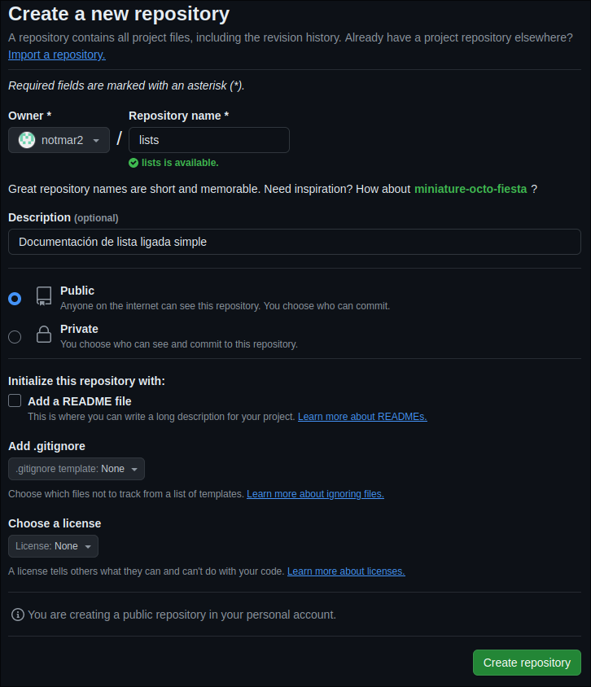

Una vez creado el repositorio debemos hacer un par de cambios en nuestro git local antes de subir el repositorio.
El primero es cambiar la rama principal a `main` en lugar de `master`, ya que esta es la rama que GitHub usa como principal.
Para esto podemos utilizar el comando `git branch` junto con la bandera `-M` que servirá para renombrar nuestra rama a "main".
Como se puede observar en la siguiente imagen, el comando no imprime nada a consola, pero gracias al tema de zsh podemos apreciar como el nombre de la rama activa cambia inmediatamente a main:
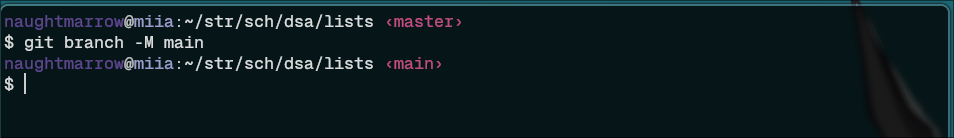

Si se utiliza el comando `git branch` por si mismo también podemos ver como la única rama que tenemos ahora es la rama main, master ya no existe.
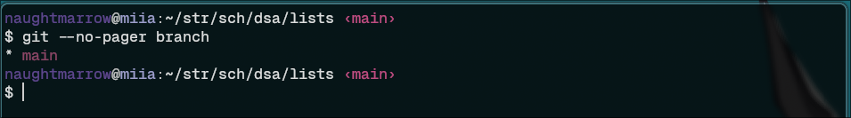

En esta caso la bandera `--no-pager` puede ser ignorada, simplemente se utilizó para propósito de tomar el screenshot de forma que se vea el comando junto con el resultado (el comportamiento default de `git branch` es similar a less y, por lo tanto, no se vería el comando).

El siguiente paso simplemente involucra añadir nuestro repositorio remoto, para esto utilizaremos el siguiente comando:

```sh
git remote add origin [link]
```

Que para nuestros propósitos se verá de la siguiente manera:

```sh
git remote add origin https://github.com/notmar2/lists.git
```

Nuevamente, este comando no regresa nada a la consola, pero si utilizamos el comando `git remote -v` podemos ver nuestros origenes.
Veamos lo que regresa a continuación:
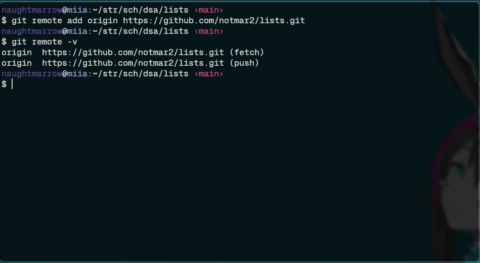

Ahora que hemos terminado de configurar nuestro repositorio para subir al remoto, podemos utilizar `git push` para terminar el proceso.
Al ser el primer push en un repositorio nuevo es importante que especifiquemos la rama de remoto que utilizaremos, esto lo podemos hacer completando nuestro comando con los siguientes argumentos `-u origin main`;
esto indica que queremos subir a nuestra rama "main" en el upstream de origen.
El resultado es el siguiente:

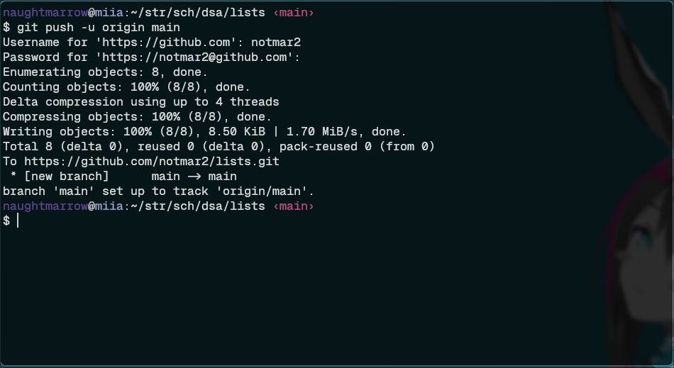

Como se puede apreciar, el comando nos pidió un usuario y una contraseña, simplemente debemos ingresar nuestras credenciales de acceso a GitHub.
En mi caso esto implica el uso de una clave PAT.
Independientemente de la forma de acceso, una vez que nuestro acceso es autorizado se comprimen los objetos y se realiza la subida.
Finalmente, se crea el enlace entre la rama local y la rama remota por lo que la próxima vez que realicemos el procedimiento no será necesario indicar la rama.

Y si revisamos nuestro repositorio remoto nos encontraremos con lo siguiente:
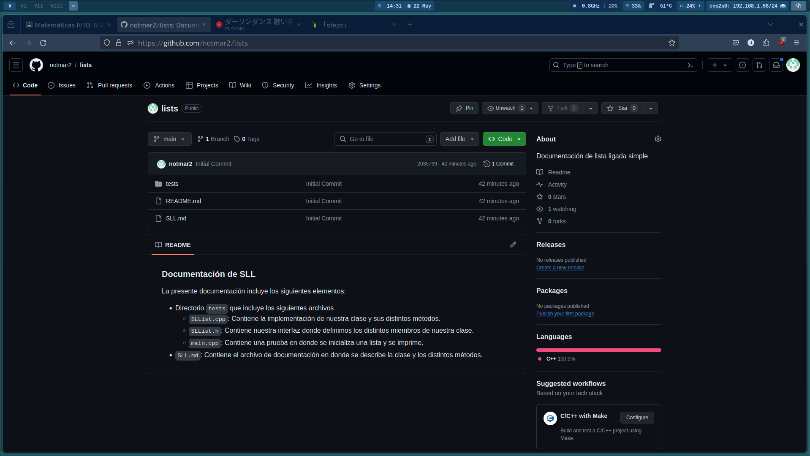
